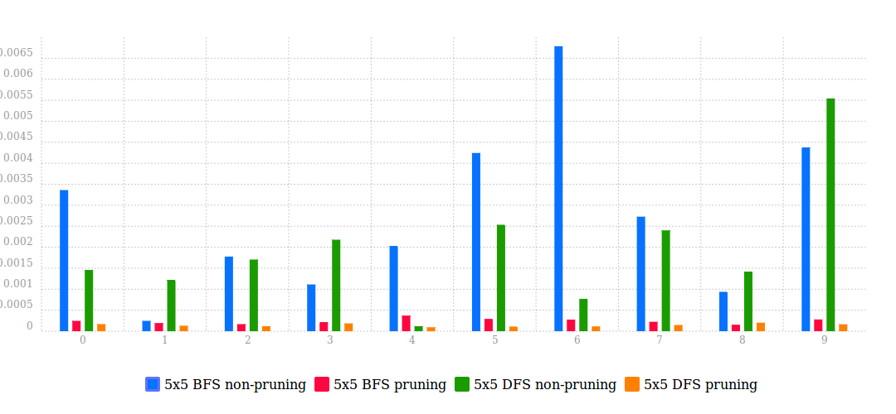
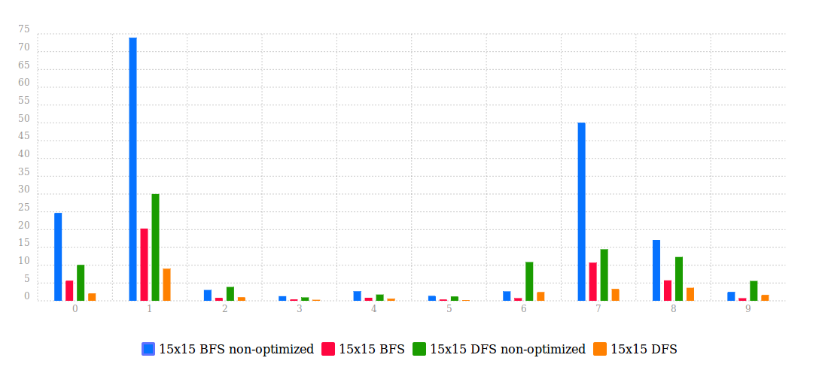

## 1. 本文名詞定義與前言

* Question: 一則 nonogram 的遊戲。
* Board: 目前的盤面整體狀況。
* Tuple: Question 中提供的線索數字組。
* State: 可以表示一 row 或 column 的配置。
* Clue table: 將 Tuple 推衍出其可能之 states 匯整理之表格。

在本文中，將**遊戲複雜度分析**、**影響演算法表現的因素**與 **影響 nonogram 困難度的因素**三種面向，將會在個章節提及之。

## 2. 定義本次實驗的 BFS 與 DFS

在此次實驗中採用了課堂上教授的 BFS 與 DFS 兩種 brute force 演算法，但與最原生的演算法有些許不同，最主要的差異在推衍合理歩的同時，增加了目前檢查 board 的合法性，也就是做了 pruning 的動作，關於剪枝的實作方式可參照第三章節，本章節主解釋演算法的 tree structure 以何種模式進行成長。

### 2-1. 遍歷方式

首先，初始盤面全為空，下一深度將會把第一 row 的合法 states 分支出去，接續的節點以此類推。以一 3\*3 盤面為例，row 的 clues 依序有 "1", "2", "1"，第一 row 有 3 種 states，便有三條分支；第二 row 有 2 種 states，在已有的三條分支再衍生出各兩條分支，目前共有 3\*2 = 6 種 boards；最後將剩餘的 row 填上，第三 row 亦有 3 種 states，最後所有以 row clues 的合理盤面共用 3\*2\*3 = 18 種 boards。然而 BFS 與 DFS 的不同，為搜索時以深度、廣度為導向，但其完整樹涵蓋的 boards 皆為一致。

### 2-2. 兩演算法對於 nonogram 的表現分析

除了直接從實驗數據顯示，DFS 的結果優異於 BFS 外。最大的原因是 nonogram 遊戲結束的條件必須所有 cells 填滿。以一 5\*5 的盤面為例，不論 BFS 或是 DFS 皆需要到深度為 5 (N) 層時才會得知勝負結果。而 BFS 在進入第 5 層前，卻已完成了第 4 (N-1) 層的所有情形列舉，亦即最終盤面（解答）位於最終層 N 愈前面，DFS 與 BFS 時間差距就會愈大。

## 3. 以預建 Table 減少重複的計算進行優化

### 3-1. 問題定義

在觀察完 nonogram 的遊戲機制後，若欲以 brute force 演算法完成之，恐會遇到以下情形。舉例一 5\*5 盤面中，在 row clue 為 `"1 2"` 的情形，只會有 `"10110", "10011", "01011"` 三種 states，除此之外的所有 states 皆屬於不合理，然而「求出有哪些合理 states」的計算會隨著深度的增加，重複的次數以複數次成長。於是我期望將這些 states 建立成表格，未來若有相同 clue 出現，將直接調用其 state。

### 3-2. 預先建表

在建立 question 的同時，便會將提供的 clues 匯入 clue table 之中。舉例，一組 5\*5 數據的 column 分別為 `"1 2", "1 1", "", "5", "1 2"` 等五組 tuples，便會將 tuple `"1 2"` 計算出它可能的所有 states：`[10110, 10011, 01011]`，以下以此類推，且重複出現過的將會略過。在演算法行經一未知的 board 將不需要重新計算可能之 states，故可直接從 clue table 中進行調用。

而這裡稍微提及，在本次的題目沒有處理非正方形盤面，但在本實驗環境因將 tuple 作為 key-by-value 的 key；states 作為 value，上述例子將可以紀錄成 `{ "5-1,2": ["10110", "10011", "01011"] }`，其中的 5 為 column 的格數（同 row 的數量），於是本方法不受 nonogram 盤面的形狀所限。

* 手繪圖. clue table 的結構。

### 3-3. 依合理性進行剪枝

預先建表還有一項優勢，在遍歷 boards 的過程中同時考量 column clue，將不符合各 columns 的 boards 結束下一深度的遞迴動作，然而這些判斷計算同上小節理由，皆是大量且繁瑣的重複計算。而剪枝的重要程度相當地高，若能愈早將確立無用 branches 剪除，便能減少後續的大量計算。

* 

### 3-4. 提昇判定合理性的速度

在進行當前 board 的 column 合理性的檢查時，倘若有出現任何不合理 state，將立即停止接下來的深度擴增。雖然這只是一個小動作，也增加了程式中的條件式，但帶來的效益卻相當地顯著。

* 

## 4. 導入 heurist 的一些案例


## 5. 程式架構與結果驗證

基於前述章節，


### 5-xxxx. 

起初

## 6. 編譯與執行方式

請參照 `code/shell.sh`，內已包含**編譯指令**、**執行方式**，若有需要修改盤面請參照註解之指示。

### 6-1. 編譯方式

```
$ cd ./code
$ g++ ./src/main.cpp ./src/elapsed_time.cpp -std==c++11 -o ./debug/out.o
```

### 6-2. 執行方式

```
// 請先確認同路徑之 ./data 含有指定檔名之 input 檔案。
$ cd ./code
// <input_data> <columns> <rows> <問題數量> <使用演算法> <重複執行輪數>
$ ./debug/out.o tcga2016-question.txt 15 15 25 DFS 10
```

### 6-3. 圖表繪製

這裡我使用 Node.js + HTML5 進行圖表的呈現，前述章節出現的圖表即為擷圖，若有需要再現程式，請進行以下操作。


